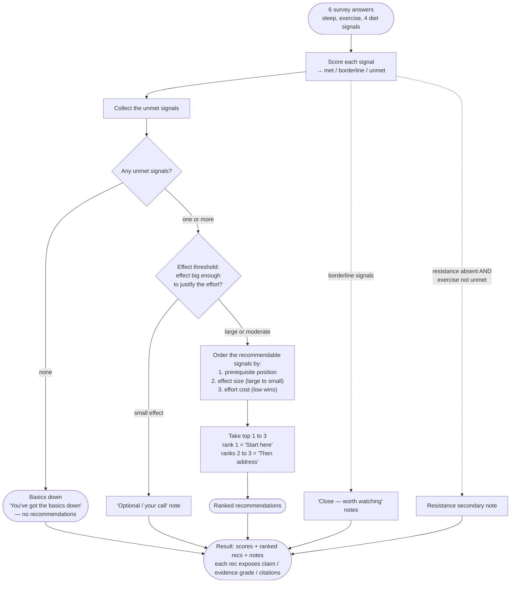

# How the prioritization works

The whole product is one loop: **collect six answers → score each signal → find the
highest-priority *unmet* basic → return 1–3 ranked recommendations, each with its evidence
shown.** Prioritization is the point — the app deliberately withholds marginal advice and
tells you when your foundation is already solid.

---

## Step 1 — Score each signal

Every signal is bucketed to `met` / `borderline` / `unmet`. Buckets are coarse on purpose
(the output is a priority, not a macro plan). These cutoffs are **provisional starting
values** (spec §4.2) and live in
[`server/src/config/thresholds.ts`](../server/src/config/thresholds.ts).

| Signal | `unmet` | `borderline` | `met` |
|---|---|---|---|
| Sleep (hours/night) | `< 6` | `6 – <7` | `≥ 7` |
| Exercise (days/week) | `0–1` | `2` | `≥ 3` |
| Protein (meals with protein) | none / rare | about one | most |
| Produce (veg+fruit servings) | ~0 | 1–2 | 3+ |
| Whole-food base (calorie base) | mostly processed | mixed | mostly whole |
| Energy balance (weight trend) | wrong way | stable | right way / at goal |

*Resistance training* is a separate yes/no that only ever produces a secondary note — it is
not one of the six scored signals.

---

## Steps 2–6 — Prioritize

### The ordering keys (in priority order)

1. **Prerequisite position.** A signal ranks ahead of another unmet signal it is *upstream
   of*, read from `interventions.prereq_of`. Two edges are encoded: `sleep` is upstream of
   exercise + the diet signals, and `diet_upf` (whole-food base) is upstream of the other
   diet signals + energy balance. Effect: **sleep tends to sort first overall**, and when
   several diet signals are red, **whole-food base surfaces first** — the spec's "fix UPF
   first" within-diet rule, expressed as data rather than a special case.
2. **Effect size** — `large` ▸ `moderate` ▸ `small`.
3. **Effort cost** — `low` wins the tiebreak (quick foundational wins first).

### The effect threshold

An unmet signal is only recommended if its effect is big enough to justify the effort
(`effect_size ≠ small`). A `small`-effect unmet signal is demoted to an *"optional / your
call"* note instead. In v1 every tier-1 signal is large/moderate, so this branch is present
and tested but currently dormant.

### Honest empty state

If no unmet signal clears the threshold, the result is **"You've got the basics down"** with
zero recommendations. The app never manufactures marginal recommendations to fill space —
for an advanced user that honest answer *is* the differentiating output.

---

## Secondary notes (context, never ranked recommendations)

- **Borderline** signals → a gentle *"close — worth watching"* note (uses `msg_borderline`).
- **Resistance training** → surfaced only when it's absent **and** exercise is not itself
  unmet. Piling "also lift weights" onto someone who isn't moving yet would violate the
  fix-the-foundation-first thesis, so it waits until the movement basics are in place.
- **Optional** → the small-effect case above.

---

## Transparency (spec §4)

Every recommendation keeps three layers **separate** so a user can disagree with the
judgment while still seeing the facts:

1. **Recommendation** — the ranked action and its message.
2. **Evidence quality** — a GRADE badge (`high` / `moderate` / `low` / `very_low`), kept
   distinct from effect size.
3. **Evidence** — the plain claim and its citations.

All effect/grade/effort values are provisional (§4.2) and every citation is currently
`verified: false`, pending the hand-verification the spec requires before a row ships.

---

## Where each piece lives in code

| Concern | File |
|---|---|
| Bucket cutoffs + effect threshold | [`server/src/config/thresholds.ts`](../server/src/config/thresholds.ts) |
| Scoring (answers → statuses) | [`server/src/domain/scoring.ts`](../server/src/domain/scoring.ts) |
| Ordering, threshold, notes, empty state | [`server/src/domain/prioritize.ts`](../server/src/domain/prioritize.ts) |
| Claims, messages, citations, effect/grade/effort | [`db/seed.sql`](../db/seed.sql) |
| Scenario tests for all of the above | [`server/src/__tests__/`](../server/src/__tests__/) |
